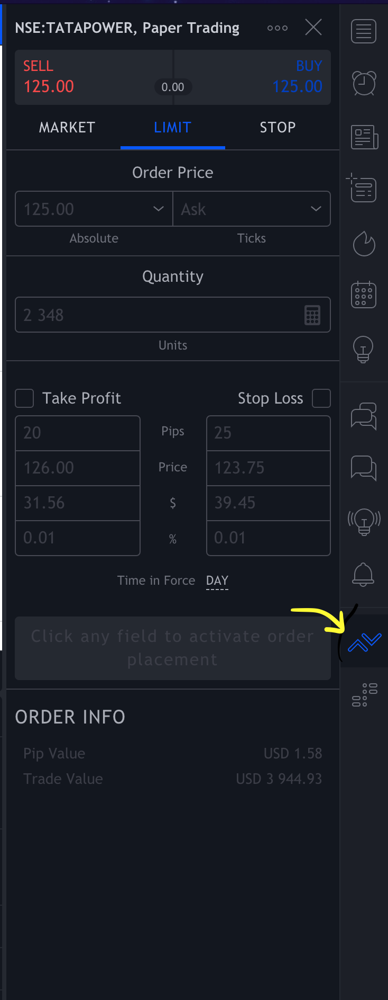

# Trading Bot in Python

This repository contains a Python-based trading bot designed to automate stock trading operations based on RSI and EMA indicators using TradingView.

## Prerequisites

Before running the bot, ensure you have the following installed on your machine:

1. **Python 3.x** (Python 3.6 or above recommended)
2. Required Python packages:
   ```bash
   pip install nsepy selenium webdriver_manager tradingview-ta
   ```

## Reference Documents

1. [Chromedriver Setup](https://sites.google.com/a/chromium.org/chromedriver/getting-started): Instructions on setting up Chromedriver for Selenium.
2. [TradingView TA Library Documentation](https://python-tradingview-ta.readthedocs.io/en/latest/overview.html): A guide to using the `tradingview-ta` Python library for fetching technical analysis data.

## How It Works

1. The bot is designed to start at **9:00 AM** on open market days.
2. It fetches technical data (RSI and EMA) for selected stocks like **Nifty** and **BankNifty**.
3. The bot runs continuously from **9:00 AM to 3:00 PM** with a 5-minute interval between executions.
4. It uses **RSI (Relative Strength Index)** and **EMA (Exponential Moving Average)** strategies to place buy/sell orders.
   - For more details on these indicators, you can refer to articles on technical analysis or use a search engine to understand them in-depth.

## Steps to Run

1. Clone the repository and navigate to the project directory.
   
   ```bash
   git clone <repository-url>
   cd tradingBotPython
   ```

2. Install the required Python libraries:
   
   ```bash
   pip install -r requirements.txt
   ```

3. Execute the bot by running:
   
   ```bash
   python3 main.py
   ```

   > **Note:** Ensure that the market is open, and it’s an appropriate trading day when running the bot.

4. After starting the script, a browser window will open and direct you to **TradingView**. Log in and connect to **paper trading**.

5. Open the **Trading Panel** by clicking the appropriate icon as shown below:

   

6. The bot will automatically place buy/sell orders based on the conditions derived from RSI and EMA values.

7. At **3:00 PM**, the bot will automatically close and summarize the profit/loss for the day.

## Important Notes

- The bot only simulates trades using paper trading on **TradingView**.
- Ensure the bot is started between **8:58 AM and 9:00 AM** on an open market day.
- Strategies used by the bot (RSI, EMA) are common in technical analysis and can be tweaked in the code to suit your needs.

## License

This project is licensed under the MIT License - see the LICENSE file for details.

